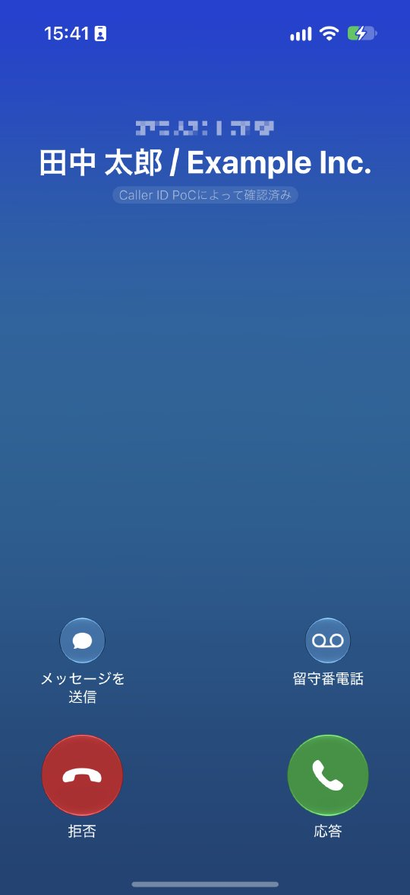
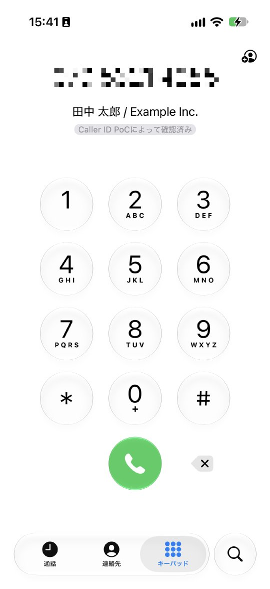
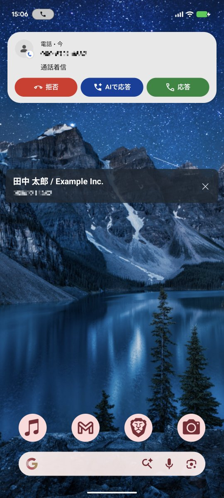
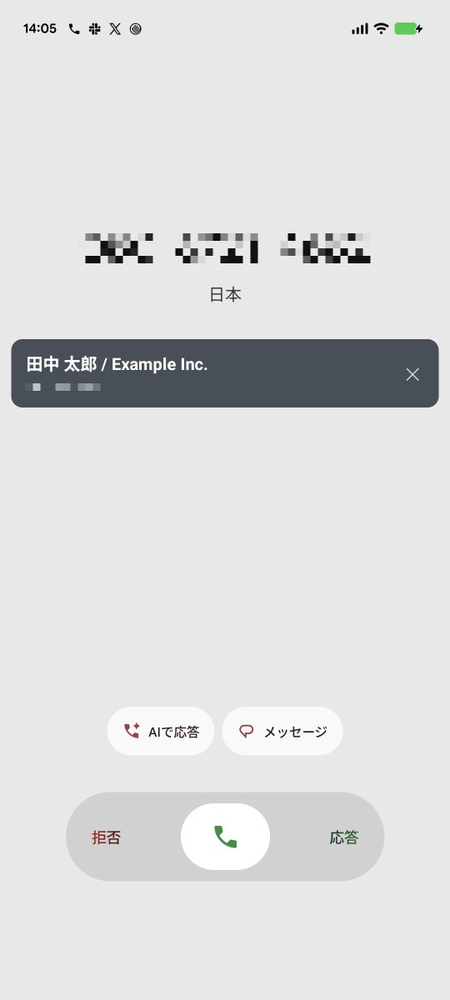

# call-screening-example

[English](./README.md)

[`expo-call-screening`](./modules/expo-call-screening/README.ja.md) のサンプルアプリです。iOS の Call Directory Extension と Android の `CallScreeningService` を使い、着信時に発信者名を表示するローカル Expo Module を動かします。

<table>
  <tr>
    <td align="center" width="25%"></td>
    <td align="center" width="25%"></td>
    <td align="center" width="25%"></td>
    <td align="center" width="25%"></td>
  </tr>
  <tr>
    <td align="center">iOS — 着信画面</td>
    <td align="center">iOS — キーパッド</td>
    <td align="center">Android — 通知と併用時</td>
    <td align="center">Android — 着信画面</td>
  </tr>
</table>

## 実行

```sh
pnpm install
EXPO_APPLE_TEAM_ID=XXXXXXXXXX pnpm expo prebuild --clean
pnpm expo run:ios --device
pnpm expo run:android --device
```

着信時の名前表示を確認するには SIM の入った実機が必要です。

画面は `src/app/index.tsx` の 1 つだけで、電話番号と表示名の保存、現在のステータス表示、モジュールの reload と権限要求の操作ができます。Android ではオーバーレイ権限の状態表示と、その権限を要求するボタンも表示されます。

## モジュールを開発するとき

モジュールの JavaScript と Config Plugin は TypeScript で、使用前にコンパイルが必要です。`pnpm install` 時に `postinstall` で JavaScript がコンパイルされます。`modules/expo-call-screening/src` または `plugin/src` を編集したら、両方を再ビルドして prebuild をやり直してください。

```sh
pnpm build:plugin
```

ルートの pnpm workspace がモジュールのビルド用依存関係もインストールします。Config Plugin の回帰テストは次のコマンドで実行できます。

```sh
pnpm test
```

モジュール単体のリリース用 tarball を作る場合（`dist/` に出力）:

```sh
pnpm pack:plugin
```

## TODO

- [ ] 電話番号の入力欄を保存前に E.164 へ正規化する（端末ロケールから取った地域を使う）。入力ミスを `setCallerIdentities` の throw ではなくフォームの時点で返せるようにする。ユーザーがどの地域の番号を入力するかを知っているのはアプリ側なので、モジュールは意図的にこれを行わない。
